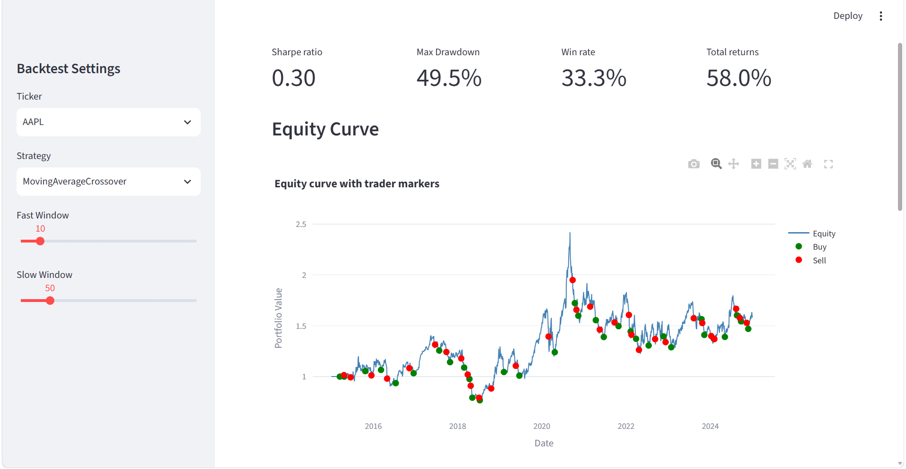
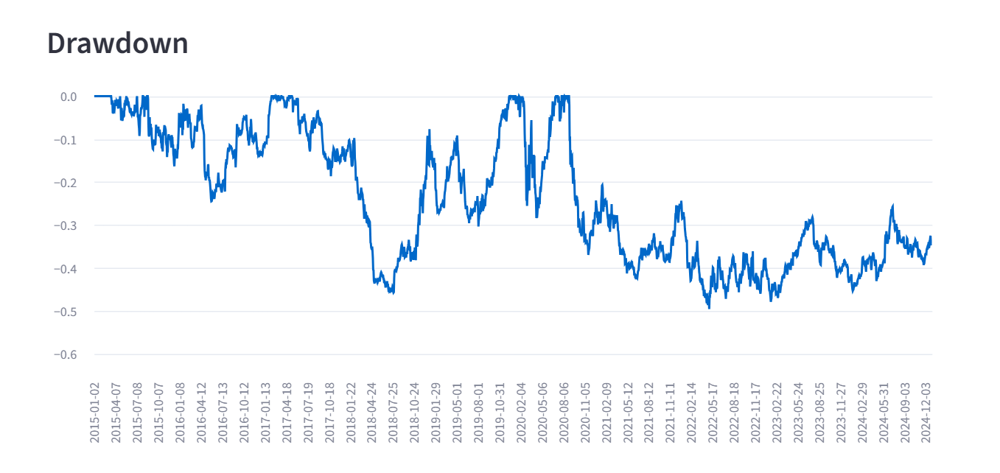
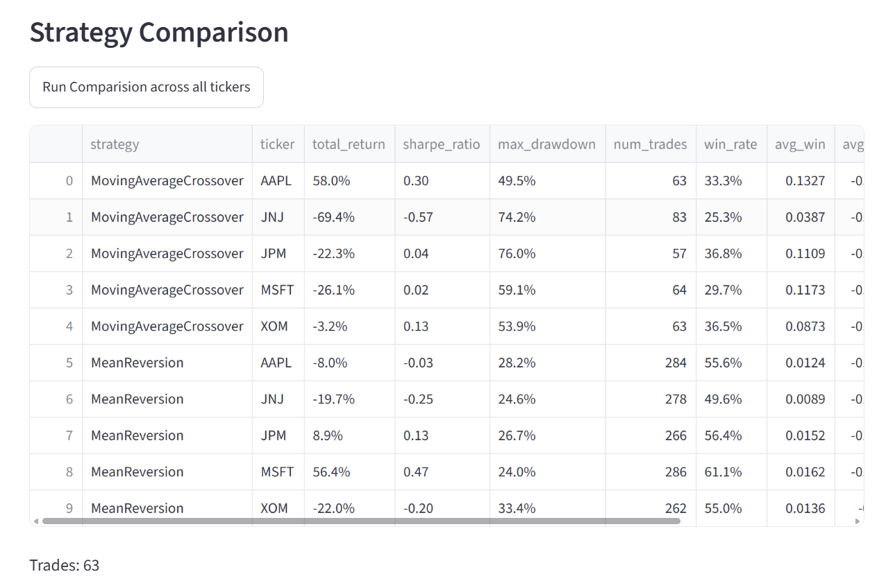

# Quant Backtesting Engine

A Python backtesting engine with a SQL-backed data pipeline, implementing and evaluating
multiple trading strategies against risk-adjusted performance metrics (Sharpe ratio, max
drawdown, win rate), extending an IMC Prosperity trading result into a demoable,
GitHub-ready project.

---

## Phase 1 — Data Pipeline

**Universe:** AAPL, MSFT, XOM, JNJ, JPM (2015-01-01 to 2025-01-01), pulled via `yfinance`
with `auto_adjust=True` (split/dividend-adjusted close).

**Schema:**
```sql
CREATE TABLE prices (
    ticker TEXT, date TEXT,
    open REAL, high REAL, low REAL, close REAL, volume INTEGER,
    PRIMARY KEY (ticker, date)
)
```

- Idempotent upsert via `INSERT OR REPLACE` — re-running the script updates rather than
  duplicates rows.
- Validation performed on every run: NaN rows dropped and counted, duplicate rows checked
  (structurally impossible given the composite primary key, verified anyway), and each
  ticker's trading days checked against a reference calendar (AAPL) to catch data gaps.
- Result: 2,516 trading days per ticker, 2015-01-02 to 2024-12-31, zero missing days,
  zero duplicates.

## Phase 2 — Backtesting Core

**Strategy interface:** an abstract `Strategy` base class defines
`generate_signal(price_history, current_idx) -> float`, returning a position in
`{-1, 0, 1}`. Every concrete strategy only ever looks at
`price_history` up to `current_idx`, avoiding lookahead bias by construction.

**Implemented strategies:**
- `MovingAverageCrossover` (fast/slow SMA crossover)
- `MeanReversion` (rolling z-score of price vs. rolling mean, thresholded at ±2σ)

**Engine:** `Backtester.run(price_df)` iterates day-by-day, asks the active strategy for
a signal, and tracks portfolio value using **returns-based accounting** — `position` is
a portfolio weight (not a share count), so results are comparable across tickers at very
different price levels. A flat transaction cost (5 bps of notional turned over) is
charged on every position change. Outputs a trade log (position changes with cost) and
an equity curve (daily portfolio value).

**Checkpoint verified:** both strategies run against multiple tickers through the same
engine with no code changes, producing a trade log and equity curve for each.

## Phase 3 — Performance Metrics

`Metrics` computes, from any `(trades, equity)` pair:
- **Total return**
- **Sharpe ratio** (annualized, 252 trading days/year, 0% risk-free rate assumed)
- **Max drawdown**
- **Win rate**, **average win**, **average loss**, **win/loss ratio** — computed from
  reconstructed per-trade P&L (return earned over each held position segment, closed out
  at the following position change)
- **Total transaction cost** paid over the run

### Results (10-year backtest, 2015–2024)

| Strategy | Ticker | Total Return | Sharpe | Max DD | Trades | Win Rate | Win/Loss Ratio |
|---|---|---|---|---|---|---|---|
| MA Crossover | AAPL | +58.0% | 0.30 | 49.5% | 63 | 33.3% | 2.86 |
| MA Crossover | XOM | -3.2% | 0.13 | 53.9% | 63 | 36.5% | 1.99 |
| Mean Reversion | AAPL | -8.0% | -0.03 | 28.2% | 284 | 55.6% | 0.81 |
| Mean Reversion | XOM | -22.0% | -0.20 | 33.4% | 262 | 55.0% | 0.71 |

**Interpretation:** the two strategies show the expected, opposite signature. MA
Crossover wins infrequently (~33–36%) but its wins are much larger than its losses
(win/loss ratio ~2–3x) — classic trend-following, where a handful of large winning
trends pay for many small whipsaw losses. Mean Reversion wins more often than not
(~55%) but each loss outweighs each win (ratio < 1), and combined with a higher trade
count (and therefore higher cumulative transaction costs), it's a net loser over this
particular 10-year window — consistent with mean reversion generally underperforming
during a trending bull market.

**Stated assumptions:**
- Transaction cost: flat 5 bps of notional per position change.
- Risk-free rate: 0% for Sharpe calculation.
- Position sizing: fully invested long/flat/short (no partial or volatility-scaled sizing).

---

## Interactive Dashboard

A Streamlit app (`src/dashboard.py`) exposes the backtester interactively:

- **Sidebar controls** — pick any ticker and strategy (strategy list is discovered
  dynamically from `Strategy.__subclasses__()`, so new strategies show up automatically),
  and tune strategy-specific parameters (fast/slow window for MA Crossover, rolling
  window and z-score threshold for Mean Reversion).
- **Live single-run view** — equity curve, drawdown chart, and Sharpe/max-drawdown/win-rate
  metric cards all update immediately as sidebar values change.

  

- **Trade markers on the equity curve** — buy and sell points are plotted directly on the
  equity curve (green for buys, red for sells) using Plotly, so entries/exits are visible
  in context rather than only in the raw trade log. The chart is fully interactive:
  hover for exact date/value, zoom/pan, and click a series name in the legend to
  show/hide that trace (e.g. hide "Sell" to declutter a high-frequency strategy like
  Mean Reversion).

  

- **Cross-strategy comparison view** — a button runs every strategy against every ticker
  with a fixed set of default parameters and displays the resulting `summary()` metrics
  side-by-side in one table, so strategies can be compared at a glance without manually
  re-running each combination.

  

Run it with `make dashboard` or `streamlit run src/dashboard.py`.

## Setup (current)

```bash
python -m venv venv
venv\Scripts\activate        # Windows
pip install -r requirements.txt

python src/data_pipeline.py          # populate data/prices.db
python -m tests.test_backtester      # run the end-to-end checkpoint
streamlit run src/dashboard.py       # launch the interactive dashboard
```